# 📚 Docthru (독스루) - 개발 문서 번역 챌린지 플랫폼


## 🚀 프로젝트 소개

Docthru는 개발 관련 영어 문서를 함께 번역하는 챌린지 플랫폼입니다. 영어로 작성된 개발 문서를 한국어로 번역하고, 피드백을 주고받으며 함께 성장하는 공간을 제공합니다.

<br/>

## 🛠️ 기술 스택 (Backend)

### 핵심 기술

[](https://nodejs.org/)
[](https://expressjs.com/)
[](https://www.prisma.io/)
[](https://www.typescriptlang.org/)
[](https://www.postgresql.org/)

### 인증 및 보안

[](https://jwt.io/)
[](https://www.npmjs.com/package/bcrypt)
[](http://www.passportjs.org/)
[](https://www.npmjs.com/package/cookie-parser)

### 유틸리티 및 개발 도구

[](https://www.npmjs.com/package/dotenv)
[](https://www.npmjs.com/package/cors)
[](https://nodemon.io/)

<br/>

## 👥 팀 소개

| 이름   | 역할    | GitHub                                   | 개인 개발 보고서                                                 |
| ------ | ------- | ---------------------------------------- | ---------------------------------------------------------------- |
| 조성빈 | 🍉 팀장 | [github](https://github.com/JJOBO/)      | [보고서](https://www.notion.so/1ec2facab63c81eca07af4d8f2bd39c0) |
| 심유빈 | 🍒 팀원 | [github](https://github.com/shimyubin/)  | [보고서](https://www.notion.so/1f32facab63c8063af31e35ceaf5e7a8) |
| 오하영 | 🍑 팀원 | [github](https://github.com/fiivxyxxng/) | [보고서](https://www.notion.so/1f32facab63c8096b969da4f5399bd3a) |
| 김홍섭 | 🍇 팀원 | [github](https://github.com/rakaso598/)  | [보고서](https://www.notion.so/1f32facab63c80088ad2eba91feb3155) |
| 황수정 | 🍎 팀원 | [github](https://github.com/suejeong/)   | [보고서](https://www.notion.so/1f32facab63c80b08333f61e56fa361e) |
| 김수경 | 🍊 팀원 | [github](https://github.com/suKyoung25/) | [보고서](https://www.notion.so/1f32facab63c806bb835c90523b6869b) |
| 박민규 | 🍈 팀원 | [github](https://github.com/gksktl111/)  | [보고서](https://www.notion.so/1f32facab63c80b4b1c0f468d3656e78) |

## 팀 문서

📝 [독스루 팀프로젝트 노션 바로가기](https://www.notion.so/1ec2facab63c808d9b80ca0759018768?v=1ec2facab63c8156b3aa000c4b136520)

## 배포 주소

🚀 [DocThru 배포 페이지 바로가기](https://6-docthru-3team-fe-dev.vercel.app/)

<br/>

## 🗺️ 시스템 아키텍처



```mermaid

graph TD
    A[src] --> B(app.js)
    A --> C[constants]
    C --> C1(time.constants.js)
    A --> D[controllers]
    D --> D1(admin.controller.js)
    D --> D2(auth.controller.js)
    D --> D3(challenge.controller.js)
    D --> D4(feedback.controller.js)
    D --> D5(notification.controller.js)
    D --> D6(user.controller.js)
    D --> D7(work.controller.js)
    A --> E[exceptions]
    E --> E1(ExceptionMessage.js)
    E --> E2(exceptions.js)
    A --> F[middlewares]
    F --> F1[passport]
    F1 --> F1a(googleStrategy.js)
    F1 --> F1b(passport.js)
    F --> F2(errorHandler.js)
    F --> F3(validator.js)
    F --> F4(verifyToken.js)
    A --> G[prisma]
    G --> G1[migrations]
    G --> G2[seed]
    G2 --> G2a[mocks]
    G2 --> G2b(seed.js)
    G --> G3(client.prisma.js)
    G --> G4(schema.prisma)
    A --> H[repositories]
    H --> H1(auth.repository.js)
    H --> H2(challenge.repository.js)
    H --> H3(feedback.repository.js)
    H --> H4(like.repository.js)
    H --> H5(notification.repository.js)
    H --> H6(user.repository.js)
    H --> H7(work.repository.js)
    A --> I[routes]
    I --> I1(admin.route.js)
    I --> I2(auth.route.js)
    I --> I3(challenge.route.js)
    I --> I4(notification.route.js)
    I --> I5(user.route.js)
    I --> I6(work.route.js)
    A --> J[services]
    J --> J1(auth.service.js)
    J --> J2(challenge.service.js)
    J --> J3(feedback.service.js)
    J --> J4(notification.service.js)
    J --> J5(user.service.js)
    J --> J6(work.service.js)
    A --> K[utils]
    K --> K1(accessToken.utils.js)
    K --> K2(auth.utils.js)
    K --> K3(initial.utils.js)
    K --> K4(scheduler.js)

```

## ✨ 백엔드 주요 기능

* **인증 및 인가 관리**
* **사용자 및 관리자 관리**
* **챌린지 및 작업물 관리**
* **피드백 및 추천 시스템**
* **알림 시스템**
* **데이터베이스 관리**

## 🎬 기능 구현 영상

[](https://youtu.be/EClrOPXoyFY)

## 📊 주요 ERD (개체-관계 다이어그램)

<details>
<summary>유저 모델</summary>


</details>

<details>
<summary>챌린지 모델</summary>


</details>

<details>
<summary>작업물 모델</summary>


</details>

## 🤯 트러블 슈팅

<details>
<summary>필터 검색 시, 카테고리 쿼리 전달</summary>


</details>

<details>
<summary>유저 정보 조회 에러</summary>


</details>

<br/>

## 🧩 프로젝트 구조

\<details\>
\<summary\>클릭하여 프로젝트 구조 보기\</summary\>

```
📦src
 ┣ 📂constants/             # 전역 상수 정의
 ┣ 📂controllers/           # API 요청 처리 및 응답 담당 (각 도메인별 분리)
 ┣ 📂exceptions/            # 커스텀 예외 및 에러 메시지 정의
 ┣ 📂middlewares/           # 요청 전처리/후처리, 인증, 유효성 검사 등 미들웨어
 ┃ ┗ 📂passport/          # Passport.js 인증 전략 (Google OAuth 포함)
 ┣ 📂prisma/                # Prisma ORM 관련 파일 (스키마, 마이그레이션, 시딩)
 ┃ ┣ 📂migrations/        # 데이터베이스 스키마 변경 이력
 ┃ ┣ 📂seed/              # 초기/테스트 데이터 시딩 로직
 ┃ ┃ ┗ 📂mocks/         # 시딩을 위한 목(Mock) 데이터
 ┣ 📂repositories/          # 데이터베이스 접근 및 쿼리 로직
 ┣ 📂routes/                # API 엔드포인트 및 라우팅 정의
 ┣ 📂services/              # 비즈니스 로직 및 데이터 처리
 ┣ 📂utils/                 # 재사용 가능한 유틸리티 함수 및 헬퍼
 ┗ 📜app.js                 # 애플리케이션의 메인 진입점
```

\</details\>

